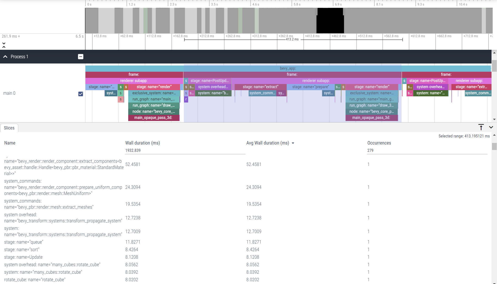
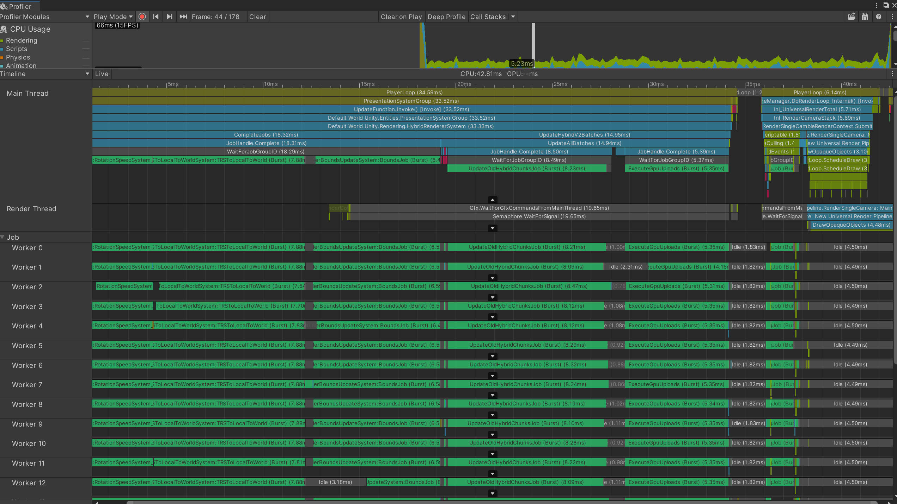

# Benchmark Bevy vs Unity

## Performance

please see code at

- [many-cubes bevy](./examples/many_cubes.rs)
- [many-cubes unity](./benchmark/unity-many-cubes/)

with 200 x 200 x 50 cubes,

| Stat                      | Bevy    | Unity  |
| ------------------------- | ------- | ------ |
| Total Frame Time          | ~400 ms | ~40 ms |
| Rotate Cube Job Time      | ~8ms    | ~3ms   |
| Update Transform Job Time | ~12ms   | ~8ms   |
| Render Batching Time      | ?       | ~15ms  |
| Rendering Time            | ~350ms  | ~6ms   |

### Profile bevy

with

```
cargo run --release --example many_cubes bevy/trace_chrome
```

then go to goto [ui.perfetto.dev](https://ui.perfetto.dev/) and load this file



### Profile Unity

using built in profiler


## WASM Build Size

please see code at

- [many-cubes bevy](./examples/many_cubes.rs)
- [many-cubes unity](./benchmark/unity-many-cubes/)
- [min-wasm bevy](./benchmark/bevy-min-wasm/)
- [min-wasm unity](./benchmark/unity-min-wasm/)

| Stat                            | Bevy    | Unity   |
| ------------------------------- | ------- | ------- |
| Minimal Cube Wasm Uncompressed  | 7.93 MB | 5.15 MB |
| Minimal Cube Wasm Gzip          | 1.97 MB | 1.85 MB |
| ECS Many Cube Wasm Uncompressed | 8.19 MB | 19.3 MB |
| ECS Many Cube Wasm Gzip         | 2.05 MB | 6.19 MB |
