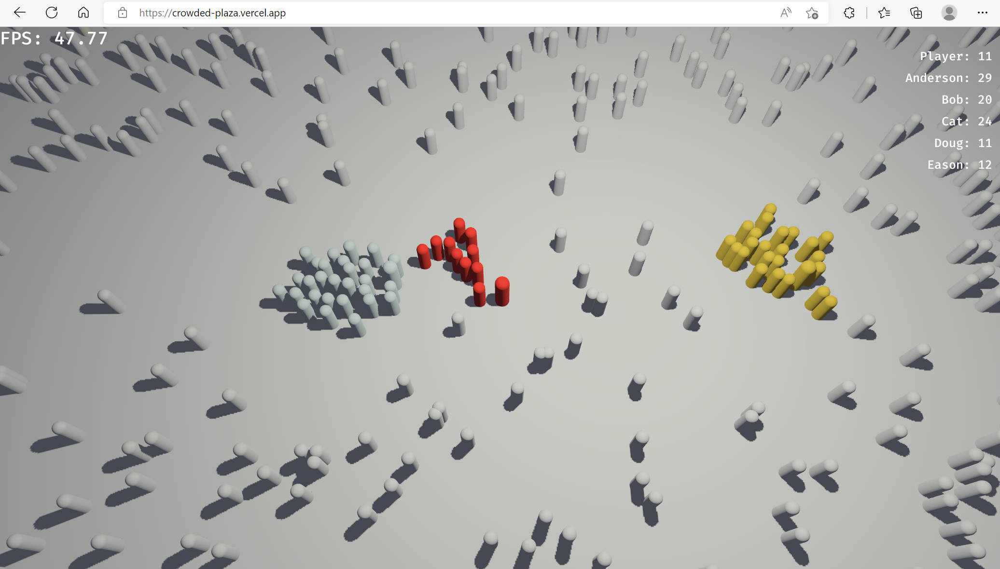

# Crowded Plaza

Inspired by [Crowded City](https://crowdedcity.io)  
An experimental io game with [bevy 0.7.0](https://github.com/bevyengine/bevy)

My blog on this [Crowded Plaza, A Game With Bevy/Rust| 拥挤广场：使用 Bevy/Rust 开发小游戏](http://ma-yidong.com/2022/07/26/crowded-plaza/)

Screenshot:


## Development Run

just

```bash
cargo run
```

## Build Wasm

```bash
# build to wasm
cargo build --profile release-wasm --target wasm32-unknown-unknown
# bind to js
wasm-bindgen --out-name game --out-dir release --no-typescript --target web target/wasm32-unknown-unknown/release-wasm/crowded-plaza.wasm
# compress to gzip
gzip -9 release/game_bg.wasm
```

Size is around

- 7.7 MB Uncompressed
- 2.0 MB gzip Compressed

## Start Game in Browser

After build wasm, run

```
python -m http.server
```

then visit `http://localhost:8000`

# Profiling and Benchmark

Conclusion

- Bevy is around 10x slower than Unity ECS on x86_64 build (bevy vulkan vs unity dx11)
- Size of Bevy minimal wasm build is similar to Unity one
- Size of Bevy ecs wasm build is 3x smaller than Unity ecs

For more details, see [Benchmark](./BENCHMARK.md) and my blog
